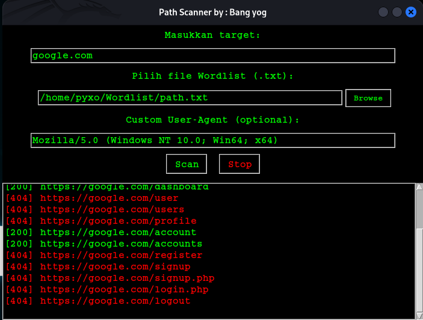

# Path Scanner GUI

Path Scanner GUI adalah aplikasi berbasis **Python** dengan antarmuka **GUI** untuk mempermudah proses scanning path/endpoint pada suatu website. Tools ini cocok untuk **pentesting web** dan membantu menemukan **directory atau file tersembunyi** dengan cepat.

---

## Fitur

- Scanning path otomatis menggunakan **wordlist**.
- Tampilan GUI yang **user-friendly** menggunakan `tkinter`.
- Mendukung input **custom target** dan **user-agent**.
- Output hasil scan ditampilkan langsung di GUI.

---

## Instalasi

1. **Clone repositori**
```bash
git clone https://github.com/YogaRmdn/Path-scanner-GUI.git
cd Path-scanner-GUI
python main.py
```

